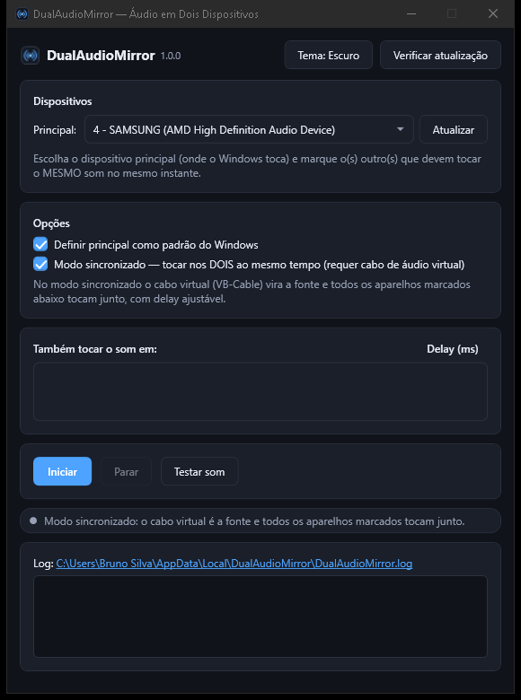

# DualAudioMirror

Tocque o mesmo áudio em dois ou mais dispositivos Windows ao mesmo tempo.

[](https://github.com/brunocsilva41/DualAudioMirror/actions/workflows/ci.yml)
[](https://github.com/brunocsilva41/DualAudioMirror/releases)
[](https://github.com/brunocsilva41/DualAudioMirror/blob/master/LICENSE)
[](https://dotnet.microsoft.com/)

## Por quê?

O Windows só entrega o som a um dispositivo por vez. Na prática isso vira atrito no dia a dia:

- Assistir um vídeo na TV enquanto o áudio toca na caixa de som do escritório.
- Fazer uma apresentação em que a sala tem projetor (sem HDMI de áudio) e caixas separadas.
- Ouvir música em duas salas sem repetir a fonte em cada uma.
- Testar saídas de áudio (fones, caixas, HDMI) sem ficar trocando o padrão do Windows o tempo todo.

O DualAudioMirror captura o que o Windows está tocando e reenvia para qualquer outro dispositivo de saída, com sincronia controlada — sem cabos extras, sem conta, sem telemetria.

## Capturas de tela

> Imagem a ser adicionada em `docs/screenshots/ui-dark.png`.



## Funcionalidades

- **Espelho de áudio** — o dispositivo principal é a fonte e todos os alvos marcam o mesmo som no mesmo instante.
- **Modo sincronizado** — o cabo virtual VB-Cable vira a fonte e todos os aparelhos tocam juntos, com **delay ajustável por dispositivo (0–400 ms)**.
- **Testar som** — toca um tom de ~4 segundos na saída escolhida para confirmar que o caminho está funcionando antes de iniciar.
- **Diagnóstico ao vivo** — KB/s capturados, tamanho do buffer, underruns, overflows e correções de drift, além do log completo em `%LocalAppData%\DualAudioMirror\DualAudioMirror.log` (clique no caminho do log na janela para abrir o arquivo).
- **Temas Dark e Light.**
- **Persistência** — dispositivo principal, alvos, delays e preferências ficam salvos entre sessões.
- **Define e restaura o padrão do Windows** — opção para tornar o principal o dispositivo padrão do sistema.
- **Offline e sem telemetria** — o app não envia dados; só consulta a API pública de Releases do GitHub quando checa atualizações.

## Requisitos

- Windows 10 ou 11, 64 bits (x64).
- O modo sincronizado exige o [VB-Cable](https://vb-audio.com/Cable/) (gratuito); o app detecta a instalação automaticamente.
- O instalador **não** exige o .NET pré-instalado — o app é publicado como self-contained com .NET 8.

## Instalação

### 1. Instalador (recomendado)

Baixe `DualAudioMirror-Setup-<versão>.exe` na página de [Releases](https://github.com/brunocsilva41/DualAudioMirror/releases), execute e siga o assistente:

- escolha instalar **somente para você** ou **para todos os usuários**;
- marque ou desmarque as tarefas de atalho na área de trabalho e "iniciar com o Windows";
- a página de dependências verifica se o VB-Cable está presente e, se necessário, pode baixá-lo e instalá-lo automaticamente.

### 2. Portátil

Baixe `DualAudioMirror-<versão>-portable.zip` na mesma página de Releases, extraia em qualquer pasta e execute `DualAudioMirror.exe`. Não instala nada no sistema.

### 3. Compilar a partir do código

Pré-requisitos: [.NET 8 SDK](https://dotnet.microsoft.com/download/dotnet/8.0) e `git`.

```pwsh
git clone https://github.com/brunocsilva41/DualAudioMirror.git
cd DualAudioMirror
pwsh scripts/build.ps1
```

A saída fica em `publish/win-x64`. Para gerar instalador e ZIP, use `pwsh scripts/package.ps1` (requer [Inno Setup 6](https://jrsoftware.org/isinfo.php)).

## Como usar

1. Abra o DualAudioMirror.
2. Em **Principal**, escolha o dispositivo onde o Windows toca o som.
3. Marque na lista **Também tocar o som em** os dispositivos que devem tocar junto.
4. Ajuste o **Delay (ms)** de cada alvo se algum aparelho atrasar em relação aos outros.
5. Clique em **Iniciar** (e **Parar** quando terminar).
6. Use **Testar som** para ouvir um tom de ~4 segundos e confirmar que cada saída está OK.
7. Para sincronia ideal, marque **Modo sincronizado** — instale o VB-Cable se o app avisar que ele não foi encontrado.

## Modo espelho × modo sincronizado

| | Modo espelho | Modo sincronizado |
|---|---|---|
| **Fonte** | Dispositivo principal escolhido no app | Cabo virtual VB-Cable (CABLE Input) |
| **Requisito** | Nenhum adicional | [VB-Cable](https://vb-audio.com/Cable/) instalado |
| **Sincronia** | Boa; varia conforme a latência de cada saída | Alta; todos tocam do mesmo buffer, com delay de 0–400 ms por dispositivo |
| **Melhor para** | Uso rápido, sem instalar nada | TV + caixa de som, apresentações, salas onde o eco é perceptível |

## Atualizações automáticas

Ao abrir, o app consulta a API pública de Releases do GitHub (a cerca de 4 segundos) e, se houver uma versão mais nova, oferece quatro opções:

- **Atualizar agora** — baixa o instalador, valida o SHA256 e o executa.
- **Baixar e instalar depois** — salva o arquivo em `Downloads` e lembra você na próxima abertura.
- **Mais tarde** — adia a decisão sem marcar nada.
- **Ignorar esta versão** — não avisa de novo sobre essa versão específica.

Para desligar a checagem, edite `%LocalAppData%\DualAudioMirror\settings.json` e defina `"AutoCheckUpdates": false`.

## Configurações e logs

- Configurações: `%LocalAppData%\DualAudioMirror\settings.json`
- Log: `%LocalAppData%\DualAudioMirror\DualAudioMirror.log`

Campos do `settings.json`:

| Campo | O que faz |
|---|---|
| `Theme` | Tema da interface (`Dark` ou `Light`) |
| `AutoCheckUpdates` | Habilita a checagem de atualizações na abertura |
| `IgnoredVersion` | Versão marcada como "Ignorar esta versão" |
| `PendingUpdatePath` | Caminho do instalador já baixado e pendente |
| `LastSourceDeviceId` | Último dispositivo principal usado |
| `LastSync` | Último estado do modo sincronizado |
| `Targets` | Lista de alvos com `DeviceId`, `Selected` e `DelayMs` |

## Solução de problemas

- **Sem som nos alvos** — confirme que o dispositivo está marcado e ativo, clique em **Testar som** e aumente o volume do alvo; verifique também se o Windows não está bloqueando o app por privacidade de microfone/áudio.
- **Modo sincronizado indisponível** — o VB-Cable não foi detectado. Instale-o em [vb-audio.com/Cable](https://vb-audio.com/Cable/) (ou pela página de dependências do instalador) e reabra o app.
- **Atraso ou perda de sincronia** — aumente o **Delay (ms)** do dispositivo que toca antes/depois dos outros; valores entre 0 e 400 ms cobrem a maioria dos casos.
- **Preciso ver o que aconteceu** — abra o log pelo link **Log** na própria janela ou acesse `%LocalAppData%\DualAudioMirror\DualAudioMirror.log`.
- **O app não abre** — verifique se existe a pasta `%LocalAppData%\DualAudioMirror` com log recente e tente executar o instalador novamente.

## Desenvolvimento

Estrutura do repositório:

- `src/` — código-fonte do app WPF (.NET 8)
- `installer/` — scripts e recursos do Inno Setup
- `scripts/` — automações (`build.ps1`, `package.ps1`, geração de ícones)
- `assets/` — ícone e imagens do instalador
- `docs/` — documentação e capturas de tela
- `.github/` — workflows de CI/CD e templates
- `tests/` — testes automatizados (planejado)

Scripts disponíveis:

- `pwsh scripts/build.ps1` — compila e publica em `publish/win-x64` (requer .NET 8 SDK)
- `pwsh scripts/package.ps1` — gera o instalador e o ZIP portátil (requer Inno Setup 6)

CI/CD (GitHub Actions):

- `ci.yml` — build e testes a cada push/PR
- `package.yml` — publica binário, instalador, ZIP e checksums
- `release.yml` — ao receber a tag `v*`, publica a GitHub Release com os assets

Commits seguem [Conventional Commits](https://www.conventionalcommits.org/pt-br/v1.0.0/) com mudanças atômicas; veja [CONTRIBUTING.md](CONTRIBUTING.md) para o fluxo de contribuição.

## Roadmap

- Testes automatizados
- Assinatura de código (code signing)
- Pacote no winget

## Licença

Distribuído sob a licença [MIT](LICENSE) — © 2026 Bruno Silva. Componentes de terceiros estão listados em [THIRD_PARTY.md](THIRD_PARTY.md).

### Agradecimentos

- [NAudio](https://github.com/naudio/NAudio) — captura e reprodução de áudio (WASAPI)
- [VB-Audio](https://vb-audio.com/) — VB-Cable, o cabo de áudio virtual do modo sincronizado
